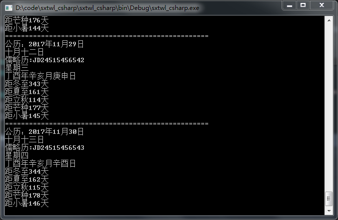
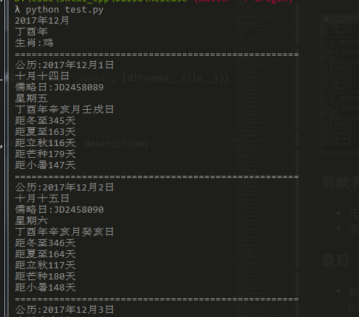

[](https://travis-ci.org/yuangu/sxtwl_cpp)
[](https://ci.appveyor.com/project/yuangu/sxtwl-cpp)

本项目 [GitHub](https://github.com/yuangu/sxtwl_cpp) / [Gitee（码云）](https://gitee.com/yuangu/sxtwl)。
## 详细介绍

sxtwl_cpp是一个[寿星天文历](http://www.nongli.net/sxwnl/)的C++实现日历库。因为其依据天文历法算法实现，故其可查询范围广(BC722年以后与实历相符)。支持Android、IOS、Windows、MacOS、Linux等平台。使用swig暴露接口给python,lua,java等语言使用。


## 功能介绍

- [x]  获取农历、公历以及天干地支数据
- [x]  农历和阴历互转
- [ ]  回历的支持
- [ ]  真太阳时支持
- [ ]  行星历的支持

## 特性

* 易于使用：使用cmake管理工程
* 多平台支持
* 查询范围广
* 免除附带表数据

## 用途

*  做为航海历使用。（注：虽然叫做农历，其实和农业生产一点关系都没有。但和航海有关）
*  命理研究
*  考古工作
*  与农历相关的数据提供 
*  天文研究
*  其它用途等我再想一下。


## 目前的缺陷

* 由于js代码为弱语言类型，在翻译成C++过程中，为了考虑精度使用的是long double类型.有些地方可以考虑用int类型替代
* 部分语法无C++语法特点。

## 效果图







## 构建方法（C++，C#，PHP,Lua等）

请参考[构建文档](doc/如何构建.md)

### Python用户懒人安装方法
```
pip install sxtwl
```
具体详情可以参考：
https://pypi.org/project/sxtwl/

## 交流沟通群

+ 如有对日历，易学等感觉兴趣的同学或使用此项目过程中遇到困难的同学，可加微信（yyguzi）入群讨论。
+ 如有需要付费类的技术支持（如，八字工具类APP，万年历，sxtwl_cpp移值等），也可以微信（yyguzi）议价合作。

## 最后

* 如果想加入此项目请联系 元谷(lifulinghan@aol.com)
* 如果使用此项目，请告之一下作者
* 如果您使用了此项目的代码，为了表示对寿星天文历原作者的尊重，请您项目适当的位置表达对许剑伟先生感谢


