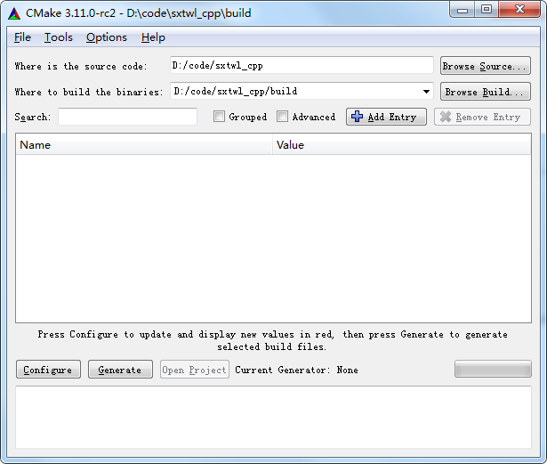
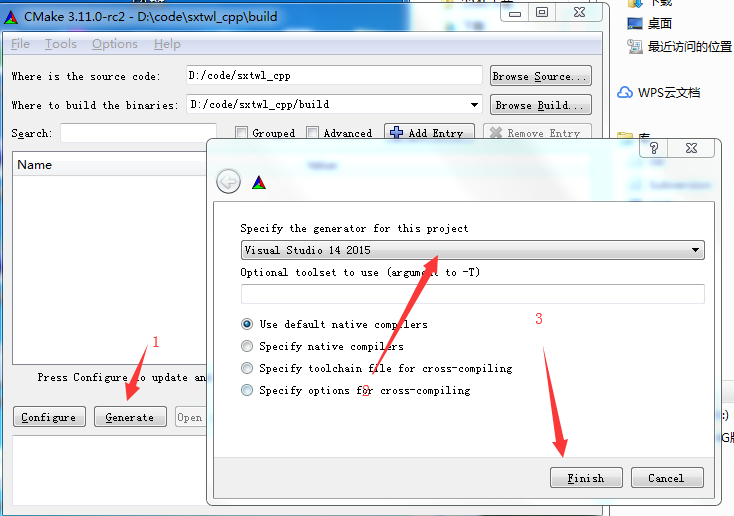
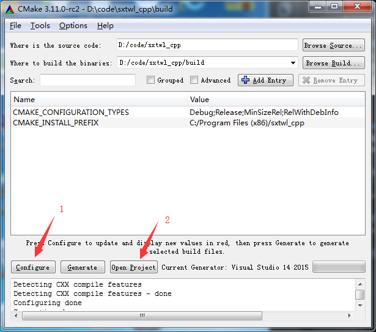
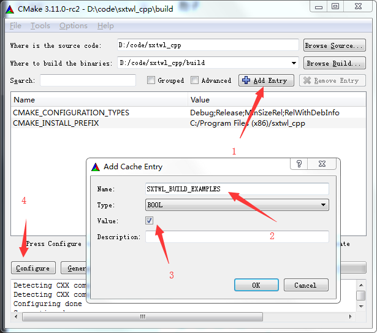
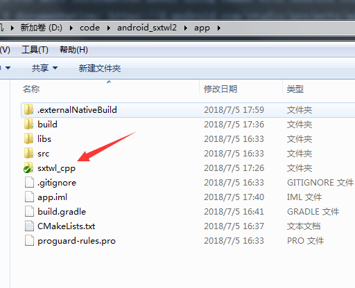
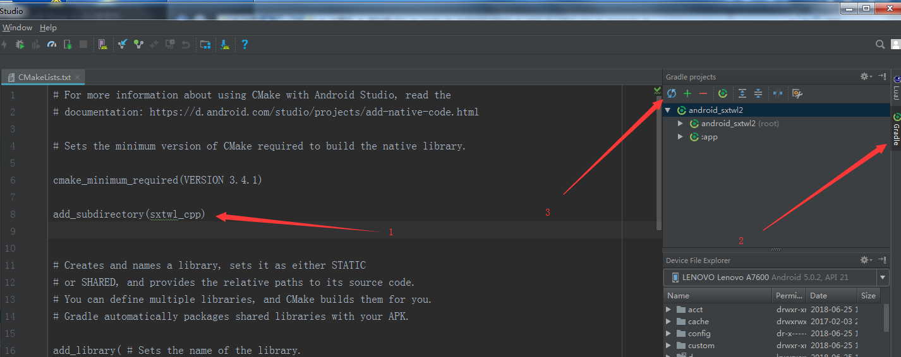

本工程使用cmake做为项目管理，以utf8做为代码格式（所以在window上，vs2015以下的版本编译前，先要做格式转换）.

### 基本环境:
* cmake下载地址(必选)：https://cmake.org/download/
* 编译器(必选): vs,g++,clang等支持c++11编译器即可
* git(可选):https://git-scm.com/
* swig下载地址(可选，如需要绑定至脚本语言时需要):  http://www.swig.org/download.html


### windows平台构建方法
1. 使用git将下载本工程代码(如果这步不会，也可以直接下载zip代码：https://github.com/yuangu/sxtwl_cpp/archive/master.zip)
git clone https://github.com/yuangu/sxtwl_cpp.git

2. 打开cmake，在"where is ths source code"里写上您刚刚下载的代码目录。在“where to build the binaries”填上编译目录（我一般是在代码目录里加一个build子目录）。如图所示:



3. 点击左下角的 "Generate" 按钮（1），弹出一个对话框。选择您的IDE（这里选择的是VS2015）（2），按Finish关闭弹窗(3)，如图所示:



4. 依次点击旁边的 "Configure"按钮 及 "Open Project"按钮(至此，您的可以编译出一个lib库出来了)，如图所示:



5. 如需要编译例子的话，您只需要增加一个参数即可。点击率 “Add Entry”按钮（1），在弹窗里的Name中输入 "SXTWL_BUILD_EXAMPLES"(2),勾选Value值（3）.按OK关闭弹窗，再点击"Configure"按钮，如图所示:


6. 如果将接口导出给python使用。请先安装swig，并将swig设置到系统的PATH环境变量里。然后按照步骤5的方法。增加一个SXTWL_WRAPPER_PYTHON的参数


### mac平台构建方法

可同windows平台构建方法，也可以用命令行:
```
$ cd ~/code/sxtwl_cpp
$ mkdir build
$ cd build
$ cmake .. -G "Unix Makefiles" -DSXTWL_BUILD_EXAMPLES=1
$ cmake --build .
```

### linux平台构建方法
可同windows平台构建方法，也可以用命令行:
```
$ cd ~/code/sxtwl_cpp
$ mkdir build
$ cd build
$ cmake .. -G "Unix Makefiles" -DSXTWL_BUILD_EXAMPLES=1
$ cmake --build .
```

### android平台构建方法

注意：一定要先安装swig，并且设置至环境变量里。为了安全起见，最好重启一下AS

1. 将代码拷贝至android工程目录下(或者直接把代码clone至代码目录下),如图所示:


2. 刷新gradle(还有一点，最好手动删除目录下的.externalNativeBuild目录)。如图所示:


3. 最后需要在java代码加入
   
```
System.loadLibrary("sxtwl_java");
```


### 另外Android独立编译方法:

```
$ set ANDROID_SDK=D:/android/sdk
$ set ANDROID_NDK=D:/android/android-ndk-r14b
$ set ANDROID_ABI=armeabi
$ set ANDROID_CMAKE=%ANDROID_SDK%/cmake/3.6.4111459/bin/cmake.exe
$ set ANDROID_NINJA=%ANDROID_SDK%/cmake/3.6.4111459/bin/ninja.exe

$ %ANDROID_CMAKE% -DANDROID_ABI=%ANDROID_ABI%   \
-DANDROID_PLATFORM=android-16  \
-DCMAKE_BUILD_TYPE=Release   \
-DANDROID_NDK=%ANDROID_NDK%    \
-DCMAKE_CXX_FLAGS=-std=c++11 -frtti -fexceptions   \
-DCMAKE_TOOLCHAIN_FILE=%ANDROID_NDK%/build/cmake/android.toolchain.cmake    \
-DCMAKE_MAKE_PROGRAM=%ANDROID_NINJA% -G "Ninja"    \
-DCONSOLE=1   \
-DSXTWL_WRAPPER_JAVA=1 ..  

$ %ANDROID_CMAKE% --build .

```

注： ANDROID_ABI  可取值： armeabi/armeabi-v7a/x86/mips/armeabi-v7a with NEON/armeabi-v7a with VFPV3/armeabi-v6 with VFP/arm64-v8a/x86_64/mips64

提示：如果遇到 Could NOT SWIG (missing: SWIG_DIR)的话，可以在cmake命令指定swig的路径： -DSWIG_EXECUTABLE=d:/swigwin-3.0.12/swig


### IOS平台编译方法(未验证)

```
$ cd build

$ cmake .. -DCMAKE_TOOLCHAIN_FILE=../cmake/ios.cmake \
-DIOS_PLATFORM=OS  \
-DCMAKE_BUILD_TYPE=Release \
-GXcode

$ cmake --build .
```
